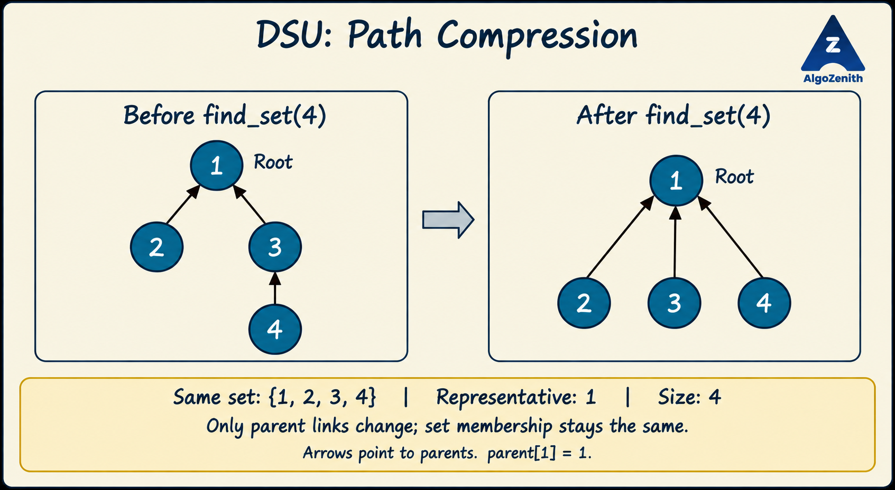

<VIDEO_WIDGET>

<VIDEO_ID></VIDEO_ID>

</VIDEO_WIDGET>

<READING_WIDGET>

# Disjoint Set Union (DSU)

Suppose we start with several separate groups. Over time, groups merge, and we repeatedly ask: **do these two elements belong to the same group?**

Disjoint Set Union, also called **Union-Find**, maintains exactly this information efficiently. In a graph, the groups can represent connected components as undirected edges are added.

## 1. What Does DSU Store?

DSU maintains a collection of **disjoint sets**: each element belongs to exactly one set, and no two sets share an element.

Initially, every element is alone. For elements `1` to `5`:

```text
{1}  {2}  {3}  {4}  {5}
```

After merging the sets containing `1` and `2`, and then those containing `2` and `3`:

```text
{1, 2, 3}  {4}  {5}
```

The second merge acts on the **entire sets** containing its arguments, not just on the individual elements `2` and `3`.

## 2. The Basic Operations

| Operation | Meaning |
| --- | --- |
| `make_set(v)` | Create a singleton set containing `v` |
| `find_set(v)` | Return the representative of the set containing `v` |
| `union_sets(a, b)` | Merge the sets containing `a` and `b`, if they differ |

Two elements belong to the same set exactly when:

```cpp
find_set(a) == find_set(b)
```

A representative is an identifier for the set, not necessarily its smallest element. It can change after a merge. Always call `find_set` when you need the current representative.

`make_set` is for initialization; calling it on an element already in a merged set would break the data structure's invariants. The complete implementation initializes all singleton sets in its constructor instead.

## 3. Represent Sets as Parent Trees

Maintain an array `parent`:

- Initially, `parent[v] = v` for every element.
- A **root** points to itself and represents its set.
- Other elements reach their representative by following parent pointers.

For example, parent links `4 -> 3 -> 1` and `2 -> 1`, with `parent[1] = 1`, represent the single set `{1, 2, 3, 4}`. Both `find_set(4)` and `find_set(2)` return `1`.

Each set forms one tree, so all sets together form a forest. These parent pointers are **DSU bookkeeping links**, not necessarily edges of the original graph. DSU does not store a graph path between two connected vertices.

## 4. Naive Implementation

The following snippets use 1-based element IDs. Allocate `parent` with size `n + 1`, then initialize each element once.

```cpp
vector<int> parent;

void make_set(int v) {
    parent[v] = v;
}

int find_set(int v) {
    if (parent[v] == v) {
        return v;
    }
    return find_set(parent[v]);
}

void union_sets(int a, int b) {
    a = find_set(a);
    b = find_set(b);
    if (a != b) {
        parent[b] = a;
    }
}

// Initialization, before processing any operations:
// parent.resize(n + 1);
// for (int v = 1; v <= n; ++v) make_set(v);
```

To merge two trees, first find their roots. Then make one root a child of the other. Linking arbitrary non-root vertices can detach part of a set or create an invalid parent structure.

### Why Can This Be Slow?

The naive merge always attaches the second root to the first. A sequence such as:

```text
union_sets(2, 1)
union_sets(3, 2)
union_sets(4, 3)
```

creates the chain:

```text
1 -> 2 -> 3 -> 4
```

With `n` elements, the chain can have `n - 1` links. A single `find_set` can therefore take **O(n)** time. A union also takes `O(n)` in the worst case because it performs two finds.

We use two complementary optimizations: shorten existing paths and avoid creating tall trees.

## 5. Optimization 1: Path Compression

When finding the root of `v`, set the parent of every visited vertex directly to that root as the recursive calls return.

```cpp
int find_set(int v) {
    if (parent[v] == v) {
        return v;
    }
    return parent[v] = find_set(parent[v]);
}
```

The important change is the assignment to `parent[v]`. We do not merely return the representative; we also remember a shortcut to it.



In the diagram, `find_set(4)` follows `4 -> 3 -> 1`. On the way back, it sets `parent[4] = 1`; `parent[3]` already equals `1`.

Path compression changes **only the tree shape**. It does not merge sets, remove elements, change the representative, or change the component count. It compresses the path visited by that find, not every branch of the forest.

A first find on an existing long chain can still take linear time. The near-constant amortized bound discussed below uses path compression **together with** union by size or rank; it is not a constant worst-case guarantee for every individual call.

## 6. Optimization 2: Union by Size

Store `size[root]`, the number of elements in the set represented by that root. Each singleton starts with size `1`.

When merging:

1. Find both roots.
2. If they are equal, do nothing.
3. Attach the smaller tree's root below the larger tree's root.
4. Add the smaller set's size to the larger set's size.

```cpp
a = find_set(a);
b = find_set(b);
if (a != b) {
    if (size[a] < size[b]) {
        swap(a, b);
    }
    parent[b] = a;
    size[a] += size[b];
}
```

Only size values **at roots** are authoritative. After attaching root `b` to root `a`, `size[b]` may remain as an old value, but it is no longer used as a component size. To get the size containing `v`, read `size[find_set(v)]`.

### Why Does Size-Based Merging Keep Trees Shallow?

Whenever a vertex's depth increases because its tree is attached below another root, its component size at least doubles. A component cannot grow beyond `n` elements, so a vertex's depth increases at most `O(log n)` times.

Thus union by size alone bounds tree height by `O(log n)`. Path compression makes future traversals even shorter.

### Union by Rank Is an Alternative, Not the Same Field

Union by rank uses a height bound instead of an element count:

- Initialize each singleton's rank to `0`.
- Attach the lower-rank root below the higher-rank root.
- If both ranks are equal, choose either root as the new root and increment its rank by `1`.

With path compression, rank is no longer necessarily the current height; it remains a useful upper bound. Do **not** add component sizes or node IDs to a rank.

The implementation below uses **union by size**, so its array is named `size`, not `rank`. We need only one of these two balancing strategies, along with path compression.

## 7. Track the Number of Components

Initially there are `n` singleton sets. Every **successful** union reduces the component count by exactly one.

If the two elements already have the same representative, no sets merge. Their sizes and the component count must stay unchanged.

This includes repeated unions, reversed repeated unions, and `union_sets(v, v)`.

## 8. Complete C++17 Implementation

This teaching program supports four query types for elements numbered `1` through `n`:

| Query | Action or output |
| --- | --- |
| `1 a b` | Merge the sets containing `a` and `b`; no output |
| `2 a b` | Print `YES` if they belong to the same set, otherwise `NO` |
| `3 v` | Print the size of the set containing `v` |
| `4` | Print the current number of components |

Input begins with `n q`, followed by `q` queries. Assume `n >= 1`, valid query types, and valid element IDs. Index `0` is unused.

```cpp
#include <algorithm>
#include <iostream>
#include <numeric>
#include <vector>
using namespace std;

class DSU {
private:
    vector<int> parent;
    vector<int> size;
    int components;

public:
    explicit DSU(int n) : parent(n + 1), size(n + 1, 1), components(n) {
        iota(parent.begin(), parent.end(), 0);
        size[0] = 0;  // Index 0 is not an element.
    }

    int find_set(int v) {
        if (parent[v] == v) {
            return v;
        }
        return parent[v] = find_set(parent[v]);
    }

    bool union_sets(int a, int b) {
        a = find_set(a);
        b = find_set(b);

        if (a == b) {
            return false;
        }
        if (size[a] < size[b]) {
            swap(a, b);
        }

        parent[b] = a;
        size[a] += size[b];
        --components;
        return true;
    }

    bool same_set(int a, int b) {
        return find_set(a) == find_set(b);
    }

    int component_size(int v) {
        return size[find_set(v)];
    }

    int component_count() const {
        return components;
    }
};

int main() {
    ios::sync_with_stdio(false);
    cin.tie(nullptr);

    int n, q;
    cin >> n >> q;
    DSU dsu(n);

    while (q--) {
        int type;
        cin >> type;

        if (type == 1) {
            int a, b;
            cin >> a >> b;
            dsu.union_sets(a, b);
        } else if (type == 2) {
            int a, b;
            cin >> a >> b;
            cout << (dsu.same_set(a, b) ? "YES" : "NO") << '\n';
        } else if (type == 3) {
            int v;
            cin >> v;
            cout << dsu.component_size(v) << '\n';
        } else if (type == 4) {
            cout << dsu.component_count() << '\n';
        }
    }
    return 0;
}
```

The constructor allocates `n + 1` entries before accessing indices `1 ... n`. The update `size[a] += size[b]` adds the **number of elements** in the absorbed component, not its representative's numeric ID.

`union_sets` returns `true` only when it actually merges two sets. This also makes successful merges easy to distinguish from redundant requests.

## 9. Dry Run and Sample

Start with five singletons. With equal sizes, this implementation keeps the first root as the representative.

| Operation | Sets afterward | Component count |
| --- | --- | --- |
| Initialize | `{1}`, `{2}`, `{3}`, `{4}`, `{5}` | 5 |
| `union_sets(1, 2)` | `{1, 2}`, `{3}`, `{4}`, `{5}` | 4 |
| `union_sets(3, 4)` | `{1, 2}`, `{3, 4}`, `{5}` | 3 |
| `union_sets(1, 3)` | `{1, 2, 3, 4}`, `{5}` | 2 |
| `find_set(4)` | Same sets; `parent[4]` becomes `1` | 2 |
| `union_sets(2, 4)` | Same sets; already connected | 2 |

The first three merges produce the four-node tree in the illustration; element `5` remains in a separate set and is omitted from that picture.

Input:

```text
5 12
4
1 1 2
1 3 4
2 2 4
1 1 3
3 4
4
1 2 4
4
2 1 4
2 1 5
3 5
```

Output:

```text
5
NO
4
2
2
YES
NO
1
```

The redundant merge of `2` and `4` does not change the component count or size.

## 10. Time and Space Complexity

| Implementation | Cost of find or union |
| --- | --- |
| Naive parent trees | `O(n)` worst case |
| Union by size/rank without path compression | `O(log n)` worst case |
| Union by size/rank with path compression | `O(alpha(n))` amortized |

Here `alpha(n)`, also written $\alpha(n)$, is the inverse Ackermann function. It grows extremely slowly, so the optimized operations are effectively constant time for practical input sizes.

**Amortized** describes the cost averaged over a sequence of operations, not a constant worst-case bound on one call. With the combined implementation, an individual find can still traverse `O(log n)` links before compression.

- Initialization: `O(n)`.
- A sequence of `q` find/union-style queries: `O(q * alpha(n))` amortized, after initialization.
- Reading the stored component count: `O(1)`.
- Total space: `O(n)` for the arrays. Recursive find uses at most `O(log n)` stack space with union by size.

## 11. Common Mistakes and Useful Insights

- **Comparing immediate parents:** `parent[a] == parent[b]` is not a general connectivity test. Different parent pointers may lead to the same root; compare representatives instead.
- **Mixing indexing conventions:** for 1-based IDs, allocate `n + 1` entries. Pushing `1 ... n` into an empty vector still creates indices `0 ... n - 1`.
- **Merging non-roots:** always find both representatives first.
- **Mixing size and rank:** sizes add; ranks increase only when equal-rank roots merge. A node ID is neither a size nor a rank.
- **Counting a redundant union:** decrement the component count only when two different roots merge.
- **Expecting a particular leader:** balancing may change the representative. It need not be the smallest vertex.
- **Treating DSU as a full graph representation:** it answers set membership and connectivity, not shortest paths. Ordinary DSU supports merging components; it does not directly support splitting a set or deleting a graph edge.

The core pattern is: **find representatives, merge only different roots, attach the smaller tree below the larger one, and compress paths during future finds.**

</READING_WIDGET>
