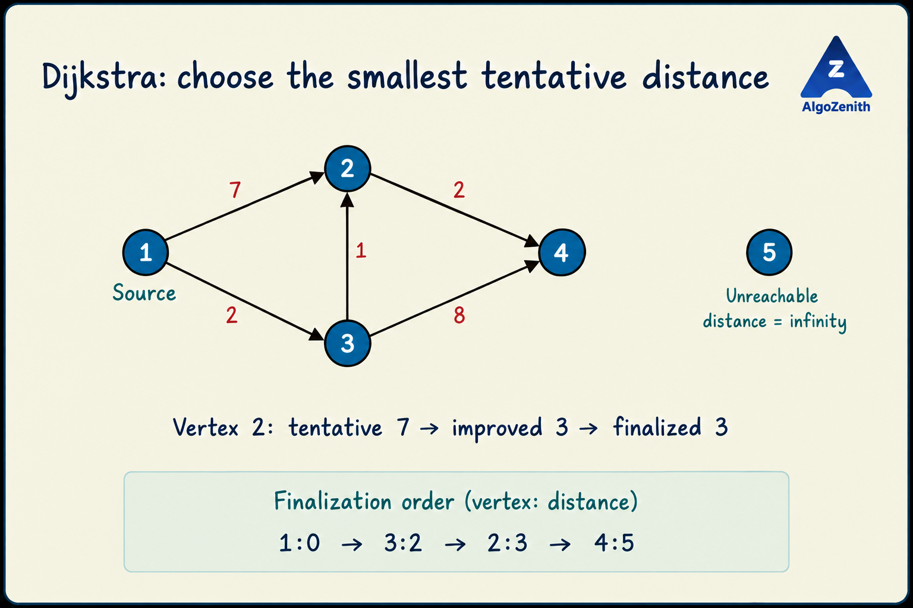

<VIDEO_WIDGET>

<VIDEO_ID></VIDEO_ID>

</VIDEO_WIDGET>

<READING_WIDGET>

# Dijkstra's Algorithm: The Core Idea

This lesson develops the reasoning behind Dijkstra's algorithm. The [next lesson](2_Dijkstra_Code.md) implements it using a min-heap and shows how to reconstruct a shortest path.

Ordinary BFS finds shortest paths when every edge has unit weight. In the previous lessons, 0–1 BFS extended this idea to weights 0 and 1 by using a deque.

Now consider edges with **arbitrary nonnegative weights**. A FIFO queue or the 0–1 deque rule no longer guarantees that we process the next smallest distance.

Dijkstra's algorithm makes that choice explicitly:

> Repeatedly select the unfinalized vertex with the smallest tentative distance, finalize it, and try to improve the distances to its neighbours.

## 1. Single-Source Shortest Paths

We are given:

- A directed or undirected graph with `n` vertices and `m` edges.
- A **nonnegative** weight on every edge; zero is allowed.
- A source vertex `s`.

For every vertex `v`, find the minimum sum of edge weights along a path from `s` to `v`. If no such path exists, report it as unreachable.

We will also maintain parent pointers so that we can reconstruct one shortest path to any reachable destination.

This is the **single-source shortest paths (SSSP)** problem. Path length here means total weight, not number of edges.

## 2. Tentative Distance vs. Final Distance

Maintain `dist[v]`, the cost of the best path from `s` to `v` found **so far**.

Initially:

$$
\text{dist}[v] =
\begin{cases}
0, & v=s,\\
\infty, & v\ne s.
\end{cases}
$$

The source has distance 0 because the empty path stays at the source and uses no edges. `INF` means that we have not yet found a path to a vertex.

Also maintain a Boolean array `settled`, initially false for every vertex:

- **Unsettled:** the tentative distance may still improve.
- **Settled:** the distance has been finalized and equals the true shortest distance.

Discovering a vertex is **not** enough to finalize it. A vertex can first be reached by an expensive path and later receive a cheaper one.



In this example, the direct edge `1 -> 2` first gives distance 7. But `1 -> 3 -> 2` costs only `2 + 1 = 3`. Vertex 2 must remain unsettled until that better route has been considered.

## 3. Relaxation: Can This Edge Improve an Answer?

Suppose the current vertex is `u`, and there is an edge `u -> v` of weight `w`.

A path that reaches `u` at cost `dist[u]` and then takes this edge has cost:

$$
\text{candidate} = \text{dist}[u] + w
$$

If this is smaller than the best known cost of reaching `v`, update it:

$$
\text{dist}[v] = \min(\text{dist}[v],\ \text{dist}[u] + w)
$$

This operation is called **relaxation**. For example, if `dist[u] = 2`, `w = 1`, and `dist[v] = 7`, the new candidate is 3, so the tentative distance to `v` improves from 7 to 3.

A relaxation updates a tentative answer; it does **not** settle the destination immediately.

## 4. The Algorithm, Step by Step

1. Set `dist[s] = 0`, all other distances to `INF`, all vertices unsettled, and all parents to `-1`.
2. Among unsettled vertices, select a vertex `u` with the smallest `dist[u]`.
3. If no such vertex exists, stop: all vertices have been settled.
4. If the smallest distance is `INF`, stop: no remaining vertex is reachable from `s`.
5. Mark `u` settled. Its shortest distance is now final.
6. Relax each outgoing edge `u -> v` whose destination is still unsettled.
7. Repeat.

There are **at most `n` successful finalizations**, not necessarily exactly `n`. Unreachable vertices remain at `INF` and do not need to be marked or expanded.

The key requirement is choosing the minimum correctly. We could scan all vertices to find it, or use a min-heap as in the code lesson. The underlying greedy rule is the same.

Ties between equal tentative distances may be broken arbitrarily. They can change which shortest path is recorded, but not the final distances.

## 5. Dry Run on the Illustrated Graph

Use source `s = 1`. The directed edges are:

```text
1 -> 2 : 7
1 -> 3 : 2
3 -> 2 : 1
2 -> 4 : 2
3 -> 4 : 8
```

Vertex 5 is isolated.

| Step | Vertex finalized | Successful relaxations | Distances `[1, 2, 3, 4, 5]` afterwards |
| --- | --- | --- | --- |
| Initial | None | `dist[1] = 0` | `[0, INF, INF, INF, INF]` |
| 1 | 1, at cost 0 | `dist[2] = 7`, `dist[3] = 2` | `[0, 7, 2, INF, INF]` |
| 2 | 3, at cost 2 | Improve 2 to `2 + 1 = 3`; reach 4 at `2 + 8 = 10` | `[0, 3, 2, 10, INF]` |
| 3 | 2, at cost 3 | Improve 4 to `3 + 2 = 5` | `[0, 3, 2, 5, INF]` |
| 4 | 4, at cost 5 | No outgoing edges | `[0, 3, 2, 5, INF]` |
| Stop | None | Only vertex 5 remains, with distance `INF` | Unchanged |

The finalization order is:

```text
Vertex:    1 -> 3 -> 2 -> 4
Distance:  0    2    3    5
```

These finalized distances are nondecreasing. Selection is based on the **whole tentative path cost**, not the vertex label, input order, or the weight of one outgoing edge.

The shortest path to 4 is:

```text
1 -> 3 -> 2 -> 4
Cost = 2 + 1 + 2 = 5
```

Both vertex 2 and vertex 4 were discovered with larger tentative distances before receiving their final answers.

## 6. Why Is Finalizing the Smallest Distance Safe?

The central claim is:

> When Dijkstra selects the smallest finite tentative distance among unsettled vertices, that distance is already optimal.

Here is the reasoning, assuming previously settled distances are correct:

1. Suppose `u` is selected, but there is a path to it cheaper than `dist[u]`.
2. On that cheaper path, consider the first vertex `x` that is still unsettled. Its preceding vertex is settled, unless `x` is the source in the initial step.
3. When that predecessor was processed, relaxation made `dist[x]` no greater than the cost of the path's prefix ending at `x`.
4. Since all remaining edges have **nonnegative** weights, that prefix costs no more than the full path to `u`.
5. Therefore, `x` would have a tentative distance strictly smaller than `dist[u]`. But `u` was chosen as the smallest, which is a contradiction.

The initial choice of the source at distance 0 is also correct because no nonnegative-weight path can cost less than 0. This starts the argument, and it applies to every later finalization.

Once a distance is finalized, it never needs to be reduced.

### Why Stop When the Minimum Is `INF`?

If an unsettled vertex were reachable, follow a path from the source to it and look at the first unsettled vertex on that path. Its settled predecessor would already have given it a finite tentative distance.

Thus, if every unsettled vertex still has `INF`, none is reachable. There is no useful work left.

## 7. Why Negative Weights Break This Reasoning

Consider these directed edges:

```text
1 -> 2 : 2
1 -> 3 : 5
3 -> 2 : -4
```

After processing source 1, Dijkstra would finalize vertex 2 at cost 2 before vertex 3 at cost 5. However:

```text
1 -> 3 -> 2 has cost 5 + (-4) = 1
```

A later path can reduce the distance of an already finalized vertex. The nonnegative-prefix argument no longer holds.

This graph does not even contain a cycle: **negative edges alone are enough to invalidate Dijkstra's guarantee**. Do not use Dijkstra when negative weights are allowed. Zero-weight edges and zero-weight cycles, on the other hand, are allowed.

## 8. Reconstructing One Shortest Path

Whenever a strict relaxation improves `dist[v]`, set `parent[v] = u`. This records that the new best path to `v` comes through `u`.

In the illustrated example, the final parents are:

```text
parent[3] = 1
parent[2] = 3
parent[4] = 2
```

For destination 4, follow parents backwards:

```text
4 -> 2 -> 3 -> 1
```

Reverse this list to obtain the forward path:

```text
1 -> 3 -> 2 -> 4
```

Check reachability **before** attempting reconstruction. An unreachable vertex has no path. For `target == source`, the path consists of the source alone and has cost 0.

Only replace a parent on a **strict improvement**, not on an equal distance. With parents assigned from a settled vertex to an unsettled vertex, parent links lead back through earlier finalizations and cannot form a cycle, even when some edge weights are zero.

If multiple shortest paths exist, these pointers retain one of them; they do not enumerate or count every shortest path.

## 9. From the Concept to an Efficient Implementation

The algorithm needs to repeatedly find the smallest tentative distance. The data structure used for this selection affects the running time:

- **Scan all vertices:** a direct implementation takes `O(n² + m)` time.
- **Use a min-heap:** store candidate `(distance, vertex)` pairs and repeatedly extract the smallest. This avoids scanning all vertices at every step and is useful for sparse graphs.

The heap can contain old candidates after a distance improves. The code lesson explains how to skip these entries, preserve the finalization rule, and account for their time and space costs.

The greedy argument does not change: always finalize the smallest useful tentative distance, then relax outgoing edges.

## 10. Common Conceptual Mistakes

- **Finalizing on discovery:** a newly reached vertex may later receive a cheaper path.
- **Choosing the smallest outgoing edge:** choose the smallest total tentative distance among all unsettled vertices instead.
- **Assuming exactly `n` vertices must be processed:** stop once the smallest remaining distance is `INF`.
- **Using Dijkstra with a negative edge:** the finalization guarantee no longer holds, even without a negative cycle.
- **Treating distance 0 as unvisited:** zero is a valid shortest distance to vertices other than the source.
- **Confusing shortest cost with fewest edges:** a longer route in steps can have a smaller total weight.
- **Assuming there is only one shortest path:** ties are possible; parent pointers select one path.

For a single-target query, stopping when that target is selected for finalization is safe. Stopping when it is first reached is not. For the all-destinations problem, continue until every reachable vertex has been finalized.

As checks, unit-weight inputs should agree with ordinary BFS, and binary-weight inputs should agree with 0–1 BFS. Different valid tie-breaking choices may produce different shortest paths with the same cost.

## Quick Recap

- Dijkstra solves single-source shortest paths with nonnegative edge weights.
- Tentative distances can improve; finalized distances cannot.
- Select the smallest finite unsettled distance, finalize it, and relax outgoing edges.
- If that minimum is `INF`, the remaining vertices are unreachable.
- Parent pointers recover one shortest path to any reachable destination.

Continue with [Dijkstra's Algorithm: Min-Heap Implementation](2_Dijkstra_Code.md) for the complete C++17 program, heap dry runs, and implementation pitfalls.

</READING_WIDGET>
