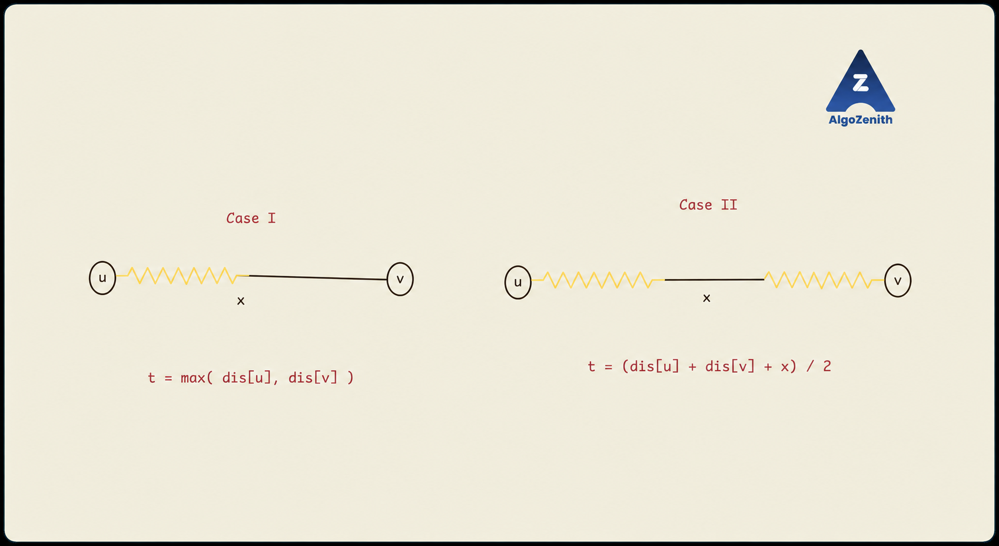

<VIDEO_WIDGET>

<VIDEO_ID></VIDEO_ID>

</VIDEO_WIDGET>

<READING_WIDGET>

# Burn Them All: Dijkstra on a Network of Threads

Dijkstra gives the earliest time when fire reaches each **vertex**. But this problem asks when every **thread** has burned completely—including points in the middle of an edge.

The solution therefore has two stages: compute vertex arrival times, then calculate the completion time of each thread.

## 1. Problem Statement

You are given an undirected graph with `n` vertices and `m` edges. An edge `(u, v, L)` represents a thread of positive integer length `L` connecting vertices `u` and `v`.

At time 0, a fire starts at a specified vertex `A`. It spreads along every available thread at a speed of **1 distance unit per time unit**. When a vertex catches fire, the fire spreads into its incident threads; an unburned thread may eventually be burning from both ends.

Find the earliest time `T` when **all threads** are completely burned, and output **`10T`**.

The starting vertex is fixed. We do not choose one route for the fire: it spreads throughout the network simultaneously.

For a finite answer, every thread must be reachable from `A`. A connected graph guarantees this. We also discuss how the implementation handles an unreachable thread.

## 2. First Find When Each Vertex Catches Fire

Traversing a thread of length `L` takes `L` time units. If there are several routes to a vertex, the fire reaches it through whichever route has the smallest total length.

Therefore:

$$
\text{dist}[u] = \text{earliest time at which vertex }u\text{ catches fire}
$$

Run Dijkstra's algorithm once from `A`, using thread lengths as edge weights. Store both directions of each edge because fire can travel either way.

After Dijkstra, **do not simply return `max(dist[u])`**. Both ends of a long thread can already be burning while a portion in its interior is still unburned.

## 3. Analyse One Thread

Consider an edge `(u, v, L)`. Let:

$$
a=\text{dist}[u],\qquad b=\text{dist}[v]
$$

These are absolute times measured from the initial ignition at `A`.

### Why Can the Arrival-Time Difference Not Exceed the Length?

Because the graph is undirected, reaching `u` and traversing this thread is one possible route to `v`:

$$
b\leq a+L
$$

Similarly, `a <= b + L`. Thus, for reachable endpoints:

$$
|a-b|\leq L
$$

There are only two cases: equality or a strictly smaller difference.



In the diagram, `x` denotes the **total thread length**, called `L` here. The yellow portions illustrate burning progressing from an endpoint; the black middle portion illustrates what remains to burn.

### Case 1: `|a - b| = L`

Assume `a <= b`. By time `b`, the fire starting from `u` has travelled `b - a = L` units and consumed the entire thread. The later endpoint catches fire just as this thread finishes burning.

$$
T_{\text{edge}}=\max(a,b)
$$

For example, if `a = 2`, `b = 7`, and `L = 5`, the thread finishes at time 7—not 5, because burning at `u` began at time 2.

Another route may reach the later endpoint at that same time; this does not change the thread's completion time.

### Case 2: `|a - b| < L`

Again assume `a <= b`. When `v` catches fire at time `b`:

- The fire from `u` has already burned `b - a` units.
- The remaining length is `L - (b - a)`.
- Two fire fronts now approach each other, burning that remaining length at a combined rate of 2 units per time unit.

Therefore:

$$
T_{\text{edge}}=b+\frac{L-(b-a)}{2}
=\frac{a+b+L}{2}
$$

Equivalently, at completion time `t`, the distances burned from the two ends add up to the whole thread:

$$
(t-a)+(t-b)=L
$$

The fire fronts need not meet at the geometric midpoint. The end that ignites earlier burns more of the thread.

For example, `a = 2`, `b = 5`, and `L = 6` give:

$$
T_{\text{edge}}=5+\frac{6-3}{2}=6.5
$$

By time 5, three units have burned from `u`. The remaining three units take another 1.5 time units to burn from both ends.

## 4. One Formula Covers Both Cases

The two cases explain the physical behaviour, but they do not require separate branches in the code.

In Case 1, with `b = a + L`:

$$
\frac{a+b+L}{2}
=\frac{a+(a+L)+L}{2}
=a+L=b
$$

So for **every reachable thread**:

$$
\boxed{T_{\text{edge}}=\frac{\text{dist}[u]+\text{dist}[v]+L}{2}}
$$

To finish burning the whole network, wait for the last thread to finish:

$$
T=\max_{(u,v,L)} T_{\text{edge}}
$$

This is a maximum over all **original threads**, not just edges used by a shortest-path tree.

## 5. Compute `10T` Without Floating Point

For one edge:

$$
10T_{\text{edge}}
=5\bigl(\text{dist}[u]+\text{dist}[v]+L\bigr)
$$

All lengths and vertex arrival times are integers. The completion time can be an integer or a half-integer, so multiplying by 10 always gives an integer.

Compute the scaled value directly:

```cpp
answer = max(answer, 5LL * (dist[u] + dist[v] + length));
```

Do not divide by 2 using integer arithmetic and then multiply by 10. For a sum of 13, that would truncate `6.5` to `6` and produce 60 instead of the correct 65.

Use `long long` for lengths, distances, the sum, and the scaled answer. Check the problem's bounds to ensure the final scaled value fits; the implementation below assumes it does.

## 6. Dry Run: Vertices Finish Before the Last Thread

Let the starting vertex be `A = 1`, with these three threads:

```text
1 -- 2 : 2
1 -- 3 : 5
2 -- 3 : 6
```

### Stage 1: Dijkstra

| Vertex finalized | Arrival time | Effect |
| --- | --- | --- |
| 1 | 0 | Reach 2 at time 2 and 3 at time 5 |
| 2 | 2 | Going to 3 through this vertex would cost `2 + 6 = 8`, so keep 5 |
| 3 | 5 | No improvement |

Final arrival times are `[0, 2, 5]`. Every vertex has caught fire by time 5.

### Stage 2: Check Every Thread

| Thread | Endpoint arrival times | Behaviour | Finish time | Scaled contribution |
| --- | --- | --- | --- | --- |
| `1–2`, length 2 | 0, 2 | One-sided; difference equals length | 2 | `5 × (0 + 2 + 2) = 20` |
| `1–3`, length 5 | 0, 5 | One-sided; difference equals length | 5 | `5 × (0 + 5 + 5) = 50` |
| `2–3`, length 6 | 2, 5 | Two-sided; difference is 3, less than 6 | 6.5 | `5 × (2 + 5 + 6) = 65` |

The answer is **65**, corresponding to `T = 6.5`.

At time 5, the `2–3` thread still has three unburned units. It finishes only at time 6.5. This thread is not needed by either shortest route from 1, but it determines the final answer.

## 7. Complete Algorithm

1. Build an undirected adjacency list for Dijkstra.
2. Also keep an edge list containing each original thread once.
3. Run Dijkstra from `A` to obtain all vertex ignition times.
4. For each original edge `(u, v, L)`:
   - Check that both endpoints are reachable.
   - Compute `5 × (dist[u] + dist[v] + L)`.
   - Update the maximum.
5. Print that maximum.

Scanning the undirected adjacency list twice per edge would still give the same maximum, but an original edge list avoids redundant work and makes the “check every thread” step explicit. Parallel threads must remain separate entries because their lengths can differ.

### What If a Thread Is Unreachable?

A thread outside `A`'s connected component never catches fire, so there is no finite completion time. Do not substitute `INF` into the formula.

If the problem guarantees a connected graph, this case cannot occur. As an explicit extension, the teaching program below prints `-1` when any thread is unreachable. Match the required output convention if using a judge with a different specification.

An isolated vertex outside the source component has no thread to burn and does not by itself prevent completion. If there are no threads at all, the answer is 0.

## 8. Complete C++17 Implementation

This uses the min-heap Dijkstra implementation from the previous lesson. Path reconstruction is unnecessary: only endpoint arrival times are needed.

### Input for This Implementation

- First line: `n m A`, the number of vertices, number of threads, and starting vertex.
- Next `m` lines: `u v length`, an undirected thread with positive integer length.
- Assume valid vertex labels and `n >= 1`.
- Numerical assumption: all finite distances and scaled edge-completion values fit in signed 64-bit integers; distances are strictly below `INF`.

### Output

Print `10T`, or `-1` for an unreachable thread under the extension described above.

```cpp
#include <algorithm>
#include <functional>
#include <iostream>
#include <limits>
#include <queue>
#include <utility>
#include <vector>
using namespace std;

using ll = long long;
using State = pair<ll, int>; // (arrival time, vertex)
const ll INF = numeric_limits<ll>::max();

struct Edge {
    int u, v;
    ll length;
};

vector<ll> dijkstra(const vector<vector<pair<int, ll>>>& g, int source) {
    int n = static_cast<int>(g.size()) - 1;
    vector<ll> dist(n + 1, INF);
    vector<char> settled(n + 1, false);
    priority_queue<State, vector<State>, greater<State>> pq;

    dist[source] = 0;
    pq.push({0, source});

    while (!pq.empty()) {
        auto [du, u] = pq.top();
        pq.pop();

        if (settled[u]) continue;
        settled[u] = true;

        for (auto [v, length] : g[u]) {
            if (settled[v]) continue;
            if (length > INF - du) continue;

            ll candidate = du + length;
            if (candidate < dist[v]) {
                dist[v] = candidate;
                pq.push({candidate, v});
            }
        }
    }

    return dist;
}

ll scaledBurnTime(const vector<Edge>& edges, const vector<ll>& dist) {
    ll answer = 0;

    for (const Edge& e : edges) {
        if (dist[e.u] == INF || dist[e.v] == INF) return -1;

        // Input bounds must ensure this sum and its scaled value fit in ll.
        ll edgeTime10 = 5LL * (dist[e.u] + dist[e.v] + e.length);
        answer = max(answer, edgeTime10);
    }

    return answer;
}

void solve() {
    int n, m, source;
    cin >> n >> m >> source;

    vector<vector<pair<int, ll>>> g(n + 1);
    vector<Edge> edges;
    edges.reserve(m);

    for (int i = 0; i < m; ++i) {
        int u, v;
        ll length;
        cin >> u >> v >> length;

        g[u].push_back({v, length});
        g[v].push_back({u, length});
        edges.push_back({u, v, length});
    }

    vector<ll> dist = dijkstra(g, source);
    cout << scaledBurnTime(edges, dist) << '\n';
}

int main() {
    ios::sync_with_stdio(false);
    cin.tie(nullptr);
    solve();
    return 0;
}
```

The guard inside Dijkstra prevents an overflowing distance addition. The final edge calculation still relies on the stated 64-bit output bound. If the actual constraints allow a larger scaled answer, use a wider integer type for the arithmetic and output.

## 9. Sample Runs

### Sample 1: A Half-Integer Completion Time

Input:

```text
3 3 1
1 2 2
1 3 5
2 3 6
```

Output:

```text
65
```

All vertices are reached by time 5, but the last thread finishes at time 6.5.

### Sample 2: A Single Thread

Input:

```text
2 1 1
1 2 7
```

Output:

```text
70
```

Fire starts at one end and takes 7 time units to reach the other end and finish the thread.

### Sample 3: Both Ends Ignite Together

Input:

```text
3 3 1
1 2 2
1 3 2
2 3 5
```

Output:

```text
45
```

Vertices 2 and 3 both catch fire at time 2. Their length-5 thread then burns from both ends for 2.5 additional time units, finishing at time 4.5.

### Sample 4: An Unreachable Thread

Input:

```text
4 2 1
1 2 3
3 4 2
```

Output under this lesson's extension:

```text
-1
```

The thread between 3 and 4 never catches fire.

## 10. Complexity

The lazy min-heap implementation has time complexity `O(n + m log(m + 2))`, including initialization and duplicate heap entries. For simple graphs, this is commonly stated as `O((n + m) log n)`.

Scanning all original threads adds `O(m)` time and does not change that overall bound. Adjacency lists, the edge list, distances, settled flags, and heap use **`O(n + m)`** total space.

There is no time-step simulation, and a thread's length does not determine how many operations we perform on it.

## 11. Common Mistakes and Useful Checks

- **Taking only the latest vertex ignition time:** a thread's interior may burn later.
- **Scanning only shortest-path-tree edges:** every original thread must burn, even if it is never part of a shortest route.
- **Summing thread completion times:** threads burn concurrently, so take the maximum.
- **Using `L / 2` alone for two-sided burning:** account for when the endpoints ignite; they may start at different times.
- **Assuming the fronts meet at the midpoint:** that is true only when endpoint ignition times are equal.
- **Dividing by 2 before scaling:** integer division loses half-time answers. Compute `5 × (a + b + L)` directly.
- **Using a narrow type for the sum or answer:** multiplying by 5 or 10 increases the required range.
- **Computing with unreachable distances:** detect an unreachable thread before applying the formula.

For every reachable thread, verify `abs(dist[u] - dist[v]) <= length`. A violation indicates inconsistent distances, edge data, or graph construction.

With integer lengths, the printed finite answer must be a multiple of 5. A single thread of length `L` ignited at one end must give `10L`.

## Quick Recap

- Dijkstra gives vertex ignition times from the fixed source.
- A reachable thread `(u, v, L)` finishes at `(dist[u] + dist[v] + L) / 2`.
- The network finishes when its last thread finishes.
- Compute the requested answer exactly as `max(5 × (dist[u] + dist[v] + L))`.

</READING_WIDGET>
