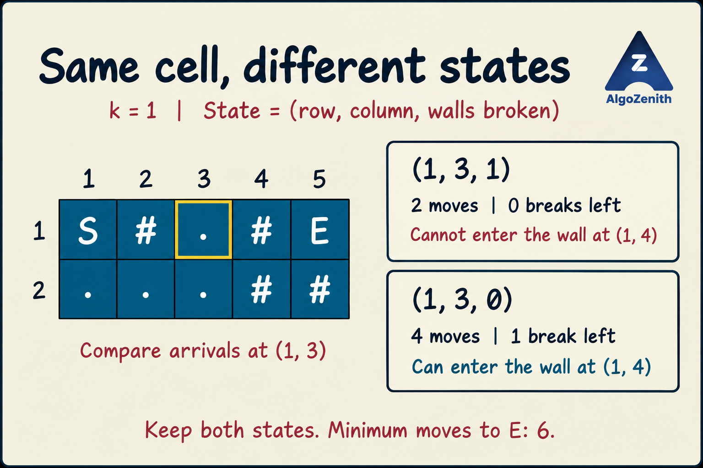

<VIDEO_WIDGET>

<VIDEO_ID></VIDEO_ID>

</VIDEO_WIDGET>

<READING_WIDGET>

# Shortest Path Idea 2: Minimum Moves with a Wall-Breaking Budget

In the [previous lesson](2_Shortest_Path_Idea_1.md), we minimized the **number of walls broken**, regardless of how many moves the route took.

Now the objective changes: minimize the **number of moves**, while breaking **at most `k` walls**.

This small change requires a different graph formulation. A cell alone is no longer a complete state—we must also know how much of the wall-breaking budget has been used.

## 1. Problem Statement

You are given an `n × m` rectangular grid with exactly one `S` and one `E`:

| Symbol | Meaning |
| --- | --- |
| `.` | Empty cell |
| `#` | Wall that can be broken |
| `S` | Starting cell |
| `E` | Ending cell |

You may move up, down, left, or right to an adjacent cell inside the grid. Every move takes **one step**, whether the destination is empty or a wall. Entering a wall consumes one wall break; breaking it does not require a separate extra move.

Given a nonnegative integer `k`, find the minimum number of moves from `S` to `E` while breaking at most `k` walls. Print `-1` if no feasible route exists.

`S` and `E` are not walls. No diagonal moves or moves outside the grid are allowed.

## 2. Separate the Objective from the Constraint

| Question | Previous lesson | This lesson |
| --- | --- | --- |
| What do we minimize? | Wall breaks | Moves |
| What limits the route? | Grid boundaries | Grid boundaries and at most `k` wall breaks |
| What does an edge cost? | 0 or 1 wall break | Exactly 1 move |
| What is a graph state? | `(row, column)` | `(row, column, breaks_used)` |
| Which algorithm fits? | 0–1 BFS | Ordinary BFS on the expanded state graph |

Wall breaks are now a **resource tracked in the state**, not the quantity stored as the shortest-path distance.

Do not use the previous lesson's minimum-wall result as the answer: it does not tell us the fewest moves among all routes within the budget.

## 3. Why Is a Two-Dimensional Visited Array Insufficient?

Consider this grid with `k = 1`:

```text
S#.#E
...##
```

Use 1-based coordinates for the explanation. Consider the empty cell `(1, 3)`.

### Route A: Reach It Quickly, but Spend the Budget

```text
(1,1) -> (1,2) -> (1,3)
   S        #         .
```

This takes **2 moves** and uses **1 wall break**. There is no budget left to enter the next wall at `(1, 4)`.

### Route B: Reach It Later, but Preserve the Budget

```text
(1,1) -> (2,1) -> (2,2) -> (2,3) -> (1,3)
   S        .         .         .         .
```

This takes **4 moves** and uses **0 wall breaks**. We can now enter `(1, 4)` by spending one break, then move to `E` at `(1, 5)`. The complete route takes **6 moves**.

If `vis[1][3]` became true after Route A, a two-dimensional visited array would discard Route B—even though Route B is the one that can finish within the budget.



The two arrivals have different future possibilities. They must be represented by different graph vertices.

## 4. Define the Expanded State

Use the state:

$$
(x, y, b), \qquad 0 \le b \le k,
$$

where `x, y` identify the current cell and `b` is the number of wall-entry charges used along the route so far. On a route without repeated cells, this is exactly the number of distinct walls broken.

Define:

```text
dist[x][y][b] = minimum moves to reach state (x, y, b)
```

Initialize every entry to `-1`, meaning the state has not been visited. This allows `dist` to serve as both the distance array and the visited marker.

The starting state is:

```text
(source_row, source_column, 0), with distance 0
```

For the same cell, `(x, y, 0)` and `(x, y, 1)` are distinct states. But two arrivals at the **same full state** have identical available transitions. Because BFS discovers that state in the fewest moves, later arrivals at that full state can safely be ignored.

### Why Do We Not Store the Identities of Broken Walls?

If broken walls stay open, revisiting one physically would not require breaking it again. Our transition model still charges whenever it enters an original `#` cell. This does not change the optimal answer for this problem:

- Any feasible route with repeated cells contains a loop. Removing the loop reduces its move count and cannot increase the number of distinct walls it needs.
- Therefore, a shortest feasible physical route can be chosen without repeated cells. On that route, each wall is entered at most once, so the counter models its breaks exactly.
- Conversely, any route accepted by the counter uses at most `k` wall entries and hence at most `k` distinct walls. It can be physically realized within the budget.

Thus the model neither invents a better physical answer nor misses an optimal one. It may count repeated wall entries conservatively on unnecessary looping routes, which we do not need for the optimum.

Keep the original grid unchanged while exploring. A wall broken by one candidate route must not become free for every other candidate route.

## 5. State Transitions and BFS

From state `(x, y, b)`, consider an in-bounds neighbour `(nx, ny)`.

Calculate its new budget usage:

```cpp
int nb = b + (grid[nx][ny] == '#');
```

- If the neighbour is `.`, `S`, or `E`, the break count stays the same.
- If it is `#`, the break count increases by one.
- If `nb > k`, the move is not allowed.
- Otherwise, if `(nx, ny, nb)` is unvisited, discover it at distance `dist[x][y][b] + 1` and put it in the queue.

Every transition costs exactly one move. Therefore, use a normal FIFO queue—not a deque that prioritizes free wall entries.

### Mark the Full State When Enqueuing

```cpp
if (nb <= k && dist[nx][ny][nb] == -1) {
    dist[nx][ny][nb] = dist[x][y][b] + 1;
    q.push({nx, ny, nb});
}
```

This is ordinary BFS on an unweighted graph of states. The first discovery of a full state is optimal, so we mark it on insertion to avoid duplicate queue entries.

### When Is the Answer Known?

There are several possible target states:

```text
(end_row, end_column, 0)
(end_row, end_column, 1)
...
(end_row, end_column, k)
```

The answer is the minimum finite distance among them—not only the distance with exactly `k` breaks.

Because the queue processes states in nondecreasing move count, we may return as soon as **any target state is removed from the queue**. If the queue becomes empty without reaching a target state, return `-1`.

## 6. Dry Run: Follow the Successful State Sequence

For the illustrated grid and `k = 1`, the successful sequence is:

| Move count | State `(row, column, breaks_used)` | Explanation |
| --- | --- | --- |
| 0 | `(1, 1, 0)` | Start at `S` |
| 1 | `(2, 1, 0)` | Move down into an empty cell |
| 2 | `(2, 2, 0)` | Move right into an empty cell |
| 3 | `(2, 3, 0)` | Move right into an empty cell |
| 4 | `(1, 3, 0)` | Move up, preserving the wall break |
| 5 | `(1, 4, 1)` | Enter a wall and use the one allowed break |
| 6 | `(1, 5, 1)` | Enter `E`; no additional break is needed |

This table traces one successful route, not every state processed by BFS. BFS also explores `(1, 3, 1)` at distance 2, but its move into `(1, 4)` would require 2 breaks and is rejected.

Why is 6 optimal? The Manhattan distance from `S` to `E` is 4. A 4-move route must go straight right along the top row, breaking two walls, so it is infeasible. Each orthogonal move flips the parity of `row + column`; these endpoints have the same parity, so a 5-move route is impossible. The demonstrated 6-move route is therefore shortest.

Changing the budget on the same grid gives:

| Budget | Minimum moves | Reason |
| --- | --- | --- |
| `k = 0` | `-1` | Both neighbours of `E` are walls |
| `k = 1` | `6` | Use the lower detour, then break `(1, 4)` |
| `k = 2` | `4` | Go straight across the top row |

## 7. Complete C++17 Implementation

### Input and Output Used Here

```text
n m k
row_1
row_2
...
row_n
```

Assume a nonempty rectangular grid with exactly one `S` and one `E`, `k >= 0`, and only the four allowed symbols. Print the minimum move count or `-1`.

The code caps the budget at the total number of walls: `K = min(k, wall_count)`. A shortest feasible route can be simple, so it never needs more breaks than there are wall cells. This avoids allocating irrelevant layers when `k` is unnecessarily large.

The distance array has `n × m × (K + 1)` entries. Use this implementation when that many states fit the memory limit and move counts fit in `int`.

```cpp
#include <algorithm>
#include <iostream>
#include <queue>
#include <string>
#include <tuple>
#include <utility>
#include <vector>
using namespace std;

int minimumMoves(const vector<string>& grid, int k,
                 pair<int, int> source, pair<int, int> target) {
    int n = static_cast<int>(grid.size());
    int m = static_cast<int>(grid[0].size());

    int wallCount = 0;
    for (const string& row : grid) {
        for (char cell : row) wallCount += (cell == '#');
    }
    int K = min(k, wallCount);

    vector<vector<vector<int>>> dist(
        n, vector<vector<int>>(m, vector<int>(K + 1, -1))
    );
    queue<tuple<int, int, int>> q; // (row, column, breaks used)

    auto [sx, sy] = source;
    dist[sx][sy][0] = 0;
    q.push({sx, sy, 0});

    const int dx[4] = {1, -1, 0, 0};
    const int dy[4] = {0, 0, 1, -1};

    while (!q.empty()) {
        auto [x, y, b] = q.front();
        q.pop();

        if (make_pair(x, y) == target) return dist[x][y][b];

        for (int dir = 0; dir < 4; ++dir) {
            int nx = x + dx[dir];
            int ny = y + dy[dir];
            if (nx < 0 || nx >= n || ny < 0 || ny >= m) continue;

            int nb = b + (grid[nx][ny] == '#');
            if (nb > K || dist[nx][ny][nb] != -1) continue;

            dist[nx][ny][nb] = dist[x][y][b] + 1;
            q.push({nx, ny, nb});
        }
    }

    return -1;
}

int main() {
    ios::sync_with_stdio(false);
    cin.tie(nullptr);

    int n, m, k;
    cin >> n >> m >> k;

    vector<string> grid(n);
    pair<int, int> source = {-1, -1};
    pair<int, int> target = {-1, -1};
    for (int i = 0; i < n; ++i) {
        cin >> grid[i];
        for (int j = 0; j < m; ++j) {
            if (grid[i][j] == 'S') source = {i, j};
            if (grid[i][j] == 'E') target = {i, j};
        }
    }

    cout << minimumMoves(grid, k, source, target) << '\n';
}
```

The queue stores only `(x, y, b)`. There is no need to store the distance again in the queue, or maintain a separate `vis` array: `dist[x][y][b]` supplies both pieces of information.

### Sample 1: Preserve the Budget for Later

Input:

```text
2 5 1
S#.#E
...##
```

Output:

```text
6
```

### Sample 2: No Feasible Route

Input:

```text
2 5 0
S#.#E
...##
```

Output:

```text
-1
```

### Sample 3: A Larger Budget Allows a Shorter Route

Input:

```text
2 5 2
S#.#E
...##
```

Output:

```text
4
```

## 8. Complexity

With `K = min(k, wall_count)`, there are at most `n × m × (K + 1)` states, each with at most four outgoing transitions.

- **Time: `O(nm(K + 1))`**, including initialization of the distance array.
- **Space: `O(nm(K + 1))`** for the distance array and queue.

Without the budget cap, both bounds are `O(nm(k + 1))`. Keep the `+1`: when `k = 0`, the algorithm still explores the zero-break layer and takes up to `O(nm)` time and space.

## 9. Common Mistakes

- **Using only `vis[x][y]`:** arrivals with different remaining budgets must not be merged blindly.
- **Minimizing wall breaks instead of moves:** every move here has cost 1; the wall count is a constraint.
- **Counting a wall move as two steps:** breaking and entering a wall is one move under this problem's rules.
- **Requiring exactly `k` breaks:** any number from 0 through `k` is allowed.
- **Checking only `dist[E][k]`:** the best target state may use fewer breaks.
- **Forgetting zero-break states:** the third dimension needs `K + 1` entries.
- **Mutating the grid when exploring a wall:** candidate routes must remain independent.
- **Allocating a huge 3D array without checking constraints:** the extra state dimension increases both runtime and memory.

The key modelling principle is: **when future moves depend on a resource already used, include that resource in the graph state. Then choose the shortest-path algorithm according to the cost of each state transition.**

</READING_WIDGET>
