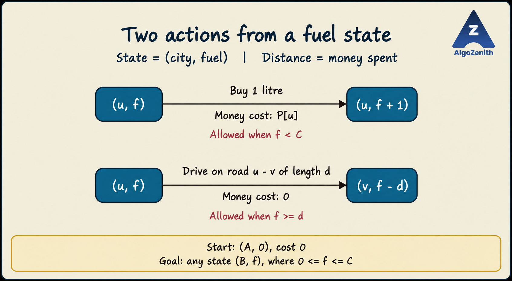

<VIDEO_WIDGET>

<VIDEO_ID></VIDEO_ID>

</VIDEO_WIDGET>

<READING_WIDGET>

# Shortest Path Idea 4: Minimum Travel Cost with a Fuel Tank

The shortest road route is not always the cheapest journey. Fuel prices vary by city, so where we buy fuel—and how much we carry—can matter more than the distance travelled.

The right graph state is **`(city, fuel_remaining)`**. From each state, we can either buy fuel or drive along a road. Dijkstra then minimizes the money spent across these actions.

## 1. Problem Statement and Assumptions

A country has `N` cities and `M` undirected roads. You start in city `A` and want to reach city `B`.

- The car's tank holds at most `C` litres.
- It consumes **1 litre per unit of road length**.
- Buying one litre in city `u` costs `P[u]`.
- Fuel is available in every city, and you may buy any amount that fits in the tank.
- Driving has no separate toll or monetary charge; it only consumes fuel.

Find the minimum total fuel cost needed to reach `B`, or report that the journey is impossible.

To match the state-based implementation, assume:

- **The tank is initially empty.**
- Capacity, road lengths, and fuel amounts are integers; purchases are in whole litres.
- Prices are nonnegative integers. Road lengths are nonnegative integers as well; zero-length roads are allowed by the code.
- You can refuel only at cities, not partway along a road.
- You may arrive at `B` with **any** amount of fuel remaining.

A road longer than `C` can never be traversed. If `A == B`, the answer is `0`: no travel or purchase is needed.

## 2. Why Is the City Alone Not Enough?

Suppose two routes reach the same city:

- One arrives cheaply but with an empty tank.
- The other costs more so far but still has fuel bought in a cheaper city.

The second arrival may lead to a cheaper complete journey because it avoids an expensive purchase later. A single `dist[city]` cannot capture these different future possibilities.

Define:

$$
\operatorname{dist}[u][f]
= \text{minimum money spent to reach city }u\text{ with exactly }f\text{ litres},
$$

where `0 <= f <= C`.

Here, **money spent is the distance**, and **fuel remaining is part of the state**. Neither means kilometres travelled.

Two routes reaching the same `(u, f)` have exactly the same choices from that point onward. Keeping only the cheaper arrival to that full state is safe.

Do not permanently mark an entire city as visited. Different fuel levels are different vertices in the expanded graph. A city may even be worth revisiting after buying cheaper fuel elsewhere.

## 3. Two Types of State Transitions



### Action 1: Buy One Litre

If `f < C`, buy one litre in the current city:

$$
(u, f) \longrightarrow (u, f+1),
\qquad \text{money cost} = P[u].
$$

Relax:

```cpp
dist[u][f + 1] = min(dist[u][f + 1], dist[u][f] + price[u]);
```

Buying several litres is represented by repeating this action. There is no need to try every possible purchase amount in a separate loop: buying `q` litres through `q` one-litre transitions costs exactly `q * P[u]`.

### Action 2: Drive to a Neighbour

For a road `u -- v` of length `d`, we may drive along it if `f >= d`:

$$
(u, f) \longrightarrow (v, f-d),
\qquad \text{additional money cost} = 0.
$$

Relax:

```cpp
dist[v][f - d] = min(dist[v][f - d], dist[u][f]);
```

The fuel was already paid for when it was purchased. Charging money again while driving would double-count the purchase. Road length reduces the fuel coordinate; it is not the edge's monetary weight in this state graph.

### Consider Both Actions Independently

At a state with space in the tank and enough fuel to drive, both actions may be possible. Relax both; do not make them mutually exclusive or buy only when the tank is empty.

An affordable purchase in the current city might be useful for a later road, even when the next road is already reachable.

## 4. Why Does Dijkstra Apply?

Every transition costs either `P[u] >= 0` or `0`. Therefore, the expanded graph has nonnegative edge weights, and Dijkstra applies normally.

- Use a min-heap containing **`(money_spent, city, fuel)`**.
- Initialize `dist[A][0] = 0`; all other states start at `INF`.
- Remove the state with the smallest tentative monetary cost.
- Finalize that full state, then relax its buy and drive transitions.
- Skip later heap entries for a state that is already finalized.

The code uses `greater` to make a min-heap. Costs are stored directly, **not negated**.

Unlike ordinary BFS, buying fuel may have a different cost in each city. Unlike 0–1 BFS, purchase costs are not restricted to 0 and 1. Dijkstra handles these arbitrary nonnegative prices.

### Why the Model Is Complete

Any valid journey can be represented as a sequence of purchases and road traversals. Split each purchase into one-litre actions; the sequence becomes a path through the state graph with exactly the same total cost.

Conversely, every path through this graph respects tank capacity and road fuel requirements, and its edge-weight sum is exactly the money paid. The shortest state-graph path therefore gives the cheapest valid journey.

Unlike a plain shortest path on the city graph, an optimal journey may revisit a city with a different fuel level. Do not discard such routes.

## 5. When Can We Return the Answer?

The possible goal states are:

```text
(B, 0), (B, 1), ..., (B, C)
```

If we run the full algorithm, the answer is:

$$
\min_{0 \le f \le C} \operatorname{dist}[B][f].
$$

We can stop sooner: the first time an **unsettled state belonging to city `B` is removed from the min-heap**, its cost is the minimum over all goal states.

Check this after skipping already-settled entries. Do not stop merely because a state at `B` was inserted into the heap; that candidate may still be improved.

If the heap becomes empty before a target state is finalized, return `-1`.

## 6. Dry Run: Buy Only Enough to Reach Cheaper Fuel

Consider three cities in a line:

```text
City:           1 -------- 2 -------- 3
Road length:         2         3
Price/litre:    5          1          9

A = 1, B = 3, C = 4
```

A good plan is to buy only 2 litres at city 1, reach city 2, then buy 3 litres at its cheaper price.

| Action | State after the action | Additional cost | Total cost |
| --- | --- | --- | --- |
| Start with an empty tank | `(1, 0)` | 0 | 0 |
| Buy 1 litre at city 1 | `(1, 1)` | 5 | 5 |
| Buy 1 litre at city 1 | `(1, 2)` | 5 | 10 |
| Drive 2 units to city 2 | `(2, 0)` | 0 | 10 |
| Buy 1 litre at city 2 | `(2, 1)` | 1 | 11 |
| Buy 1 litre at city 2 | `(2, 2)` | 1 | 12 |
| Buy 1 litre at city 2 | `(2, 3)` | 1 | 13 |
| Drive 3 units to city 3 | `(3, 0)` | 0 | **13** |

This traces one optimal plan, not every state removed from the heap. Dijkstra also considers alternatives, such as buying more fuel at city 1.

Why is 13 optimal? We must buy at least 2 litres at price 5 to reach city 2 for the first time. The journey requires at least 5 litres in total, and the cheapest price anywhere is 1. Thus every plan costs at least `2 * 5 + 3 * 1 = 13`, which this plan achieves.

### Why Not Always Fill the Tank?

Filling the 4-litre tank in city 1 costs 20. After reaching city 2, only 2 litres remain, so one more litre must be bought there. The total becomes **21**, rather than 13.

The algorithm chooses where and how much to refuel by exploring purchase transitions; it does not use an “always fill” rule.

## 7. Complete C++17 Implementation

### Input and Output Used Here

```text
N M C A B
P[1] P[2] ... P[N]
u1 v1 length1
u2 v2 length2
...
uM vM lengthM
```

City labels are 1-based. Roads are undirected. Print the minimum monetary cost, or `-1` if the trip is impossible.

The arrays are allocated dynamically for the actual capacity; there is no hidden assumption that `C <= 100`. Still, `N * (C + 1)` states must fit the memory limit. `N`, `C`, and road lengths must fit the integer types used, and `C + 1` must be representable.

Prices and total costs use `long long`. All prices are nonnegative, and every finite shortest state cost needed by the query must be strictly below `INF = LLONG_MAX`. The purchase relaxation guards against overflow before adding the price. If valid answers exceed this range, a wider representation is needed.

```cpp
#include <functional>
#include <iostream>
#include <limits>
#include <queue>
#include <tuple>
#include <utility>
#include <vector>
using namespace std;

using ll = long long;
using State = tuple<ll, int, int>; // (money spent, city, fuel)
const ll INF = numeric_limits<ll>::max();

ll minimumFuelCost(const vector<vector<pair<int, int>>>& g,
                   const vector<ll>& price, int capacity,
                   int source, int target) {
    int n = static_cast<int>(g.size()) - 1;

    vector<vector<ll>> dist(n + 1, vector<ll>(capacity + 1, INF));
    vector<vector<char>> settled(
        n + 1, vector<char>(capacity + 1, false)
    );
    priority_queue<State, vector<State>, greater<State>> pq;

    dist[source][0] = 0;
    pq.push({0, source, 0});

    while (!pq.empty()) {
        auto [cost, u, fuel] = pq.top();
        pq.pop();

        if (settled[u][fuel]) continue;
        settled[u][fuel] = true;

        if (u == target) return cost;

        // Action 1: buy one litre in the current city.
        if (fuel < capacity && price[u] <= INF - cost) {
            ll candidate = cost + price[u];
            if (!settled[u][fuel + 1] &&
                candidate < dist[u][fuel + 1]) {
                dist[u][fuel + 1] = candidate;
                pq.push({candidate, u, fuel + 1});
            }
        }

        // Action 2: drive using fuel already in the tank.
        for (auto [v, length] : g[u]) {
            if (fuel < length) continue;
            int remaining = fuel - length;

            if (!settled[v][remaining] && cost < dist[v][remaining]) {
                dist[v][remaining] = cost;
                pq.push({cost, v, remaining});
            }
        }
    }

    return -1;
}

int main() {
    ios::sync_with_stdio(false);
    cin.tie(nullptr);

    int n, m, capacity, source, target;
    cin >> n >> m >> capacity >> source >> target;

    vector<ll> price(n + 1);
    for (int u = 1; u <= n; ++u) cin >> price[u];

    vector<vector<pair<int, int>>> g(n + 1);
    for (int i = 0; i < m; ++i) {
        int u, v, length;
        cin >> u >> v >> length;
        g[u].push_back({v, length});
        g[v].push_back({u, length});
    }

    cout << minimumFuelCost(g, price, capacity, source, target) << '\n';
}
```

### Sample 1: The Dry Run

Input:

```text
3 2 4 1 3
5 1 9
1 2 2
2 3 3
```

Output:

```text
13
```

### Sample 2: A Cheap-Fuel Detour Can Revisit a City

Input:

```text
3 2 4 1 3
10 1 10
1 2 1
1 3 3
```

Output:

```text
14
```

The direct route `1 -> 3` requires buying 3 litres in city 1, costing 30. Instead:

1. Buy 1 litre in city 1 for 10 and drive to city 2.
2. Buy 4 litres in city 2 for 4.
3. Drive back to city 1, retaining 3 litres.
4. Drive to city 3 without buying more fuel.

Total cost: `10 + 4 = 14`. The arrivals `(1, 0)` and `(1, 3)` are different states. Marking city 1 as permanently visited at the start would incorrectly discard this plan.

### Sample 3: A Road Exceeds the Tank Capacity

Input:

```text
2 1 2 1 2
1 1
1 2 3
```

Output:

```text
-1
```

There is no refuelling stop on the road, and the tank cannot hold the 3 litres required.

## 8. Complexity: Count States and Transitions

The expanded graph has:

$$
S = N(C+1)
$$

states, including fuel level zero.

Its transitions are **not just the original `M` roads**:

- **Buy transitions:** `NC`, one from each fuel level `0` through `C - 1` in every city.
- **Drive transitions:** an undirected road of length `d <= C` gives `2(C - d + 1)` transitions, one in each direction for each feasible starting fuel level `d` through `C`.

Thus the number of valid state edges is:

$$
E_{\text{state}} = NC + 2\sum_{\text{roads}}\max(0, C-d+1).
$$

The implementation also checks roads that cannot be traversed at the current fuel level. Across all states, it scans at most `2M(C+1)` adjacency entries. Let:

$$
R = NC + 2M(C+1).
$$

With the lazy min-heap used above:

- **Time:** `O(S + R log(R + 2))` in the worst case, including state-array initialization. At most `O(R)` improved candidates enter the heap.
- **Space:** `O(S + M + R)` as a general upper bound, including original roads, state arrays, and potentially duplicate heap entries. We do not explicitly store the expanded edges.

For a simple original graph, the time bound is commonly written as **`O((N + M)(C + 1) log(N(C + 1)))`** when `N(C + 1) >= 2`. In particular, the road-processing term must also include the capacity factor. Early stopping can reduce work, but not these worst-case bounds.

Capacity is therefore a practical constraint: a graph with moderate `N` and `M` may still produce too many states when `C` is large.

## 9. Common Mistakes

- **Using only `dist[city]` or `vis[city]`:** remaining fuel changes which moves are possible and which purchases are needed.
- **Treating road length as money spent:** driving consumes fuel; buying fuel adds money.
- **Starting with a free full tank:** the stated initial state is `(A, 0)`.
- **Always filling up or buying only when empty:** neither rule explores every useful refuelling plan.
- **Checking only one goal fuel level:** any state in city `B` is acceptable.
- **Returning when a goal candidate is inserted:** wait until an unsettled goal state is removed at minimum cost.
- **Negating costs despite using `greater`:** this heap already prioritizes the smallest positive cost.
- **Forgetting `C + 1` levels:** both zero fuel and a full tank are valid states.
- **Quoting the complexity of the original city graph:** roads create transitions at many fuel levels.

The formulation to remember is: **state = city plus fuel; buying increases fuel and costs money; driving decreases fuel and costs no additional money.**

</READING_WIDGET>
