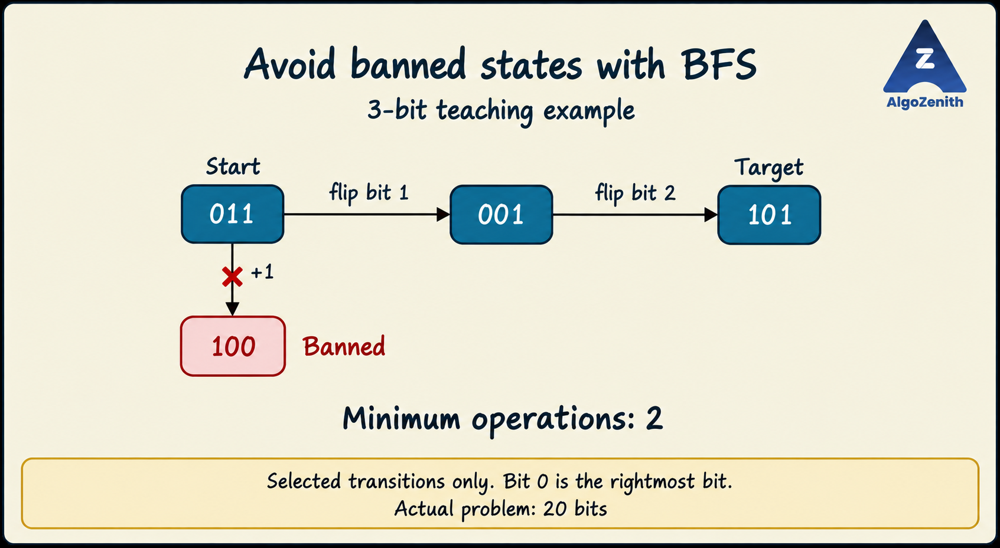

<VIDEO_WIDGET>

<VIDEO_ID></VIDEO_ID>

</VIDEO_WIDGET>

<READING_WIDGET>

# Shortest Path Idea 6: Binary Strings as an Implicit Graph

A graph vertex does not have to represent a city or a grid cell. It can represent the **entire configuration of a problem**.

Here, each binary string is a state, and each allowed operation is an edge. Since every operation costs one step, we can find the minimum number of operations using ordinary BFS.

## 1. Problem Statement

You are given an initial binary string `start`, a target binary string `target`, and `k` banned binary strings. Every string has exactly **20 bits**.

Starting from `start`, you may perform either operation on the current string:

1. **Add one** to its numeric value, provided the result still fits in 20 bits.
2. **Flip one bit**, changing `0` to `1` or `1` to `0` at any position.

Each operation costs **1**. Find the minimum number of operations needed to reach `target` without ever occupying a banned state. Return `-1` if no valid transformation exists.

Important rules:

- The initial and target strings must also be allowed.
- Incrementing `11111111111111111111` is forbidden. There is **no wraparound** to zero.
- If `start == target` and that state is allowed, the answer is `0`.

## 2. Encode Each String as a Vertex

There are

$$
2^{20} = 1,048,576
$$

possible 20-bit strings. Their numeric values range from `0` to `(1 << 20) - 1`, so we can use these values directly as array indices.

For example:

```text
Binary string           State ID
00000000000000000000    0
00000000000000000011    3
00000000000000000101    5
11111111111111111111    1048575
```

Leading zeroes do not need to be stored in the state ID: the fixed width of 20 bits determines the original string uniquely.

To convert a string, read it from left to right. For each new bit, multiply the current value by two and add the bit:

```cpp
value = (value << 1) + (bit - '0');
```

## 3. Operations Become Graph Edges

For a state `x`, generate its possible next states as follows.

### Add One

If `x < (1 << 20) - 1`, the next state is `x + 1`.

This is a directed transition. We cannot automatically add an edge from `x + 1` back to `x`, because subtraction is not one of the operations.

### Flip One Bit

Number bit positions from `0` to `19`, with **bit 0 at the rightmost position**. Flipping bit `j` produces:

```cpp
int next = x ^ (1 << j);
```

XOR with a mask containing one set bit toggles only that position. The result always remains within the 20-bit state space. Bit flips are reversible, but the graph as a whole must still respect the direction of increment operations.

There are **at most 21 candidate operations** per state: one increment and 20 bit flips. These do not necessarily produce 21 distinct neighbours. For example, from an even number, incrementing and flipping bit 0 produce the same result.

### Exclude Banned States

Maintain `banned[x]` for every state ID. Reject any generated neighbour whose flag is set.

Check the source before starting BFS. Since banned states are never enqueued, their outgoing transitions are never explored either. This is equivalent to removing banned vertices and their incident edges from the graph.

## 4. Generate Neighbours Only When Needed

Building an adjacency list for every state would store roughly **22 million operation transitions** before removing banned states or duplicates.

We do not need to store them. Both operations can generate neighbours directly from a state ID whenever BFS processes it. This is an **implicit graph**: its vertices and edges are defined by rules rather than stored as adjacency lists.

We only store:

- `banned[x]`: whether state `x` is forbidden.
- `dist[x]`: minimum operations from the source, or `-1` if undiscovered.
- A FIFO queue of discovered states waiting to be processed.

## 5. BFS on the State Space

1. If either endpoint is banned, return `-1`.
2. Set `dist[start] = 0` and enqueue it.
3. Remove a state `x` from the front of the queue.
4. If `x` is the target, return `dist[x]`.
5. Generate the legal increment and all 20 bit flips.
6. For each allowed, undiscovered neighbour `next`, set `dist[next] = dist[x] + 1` and enqueue it.
7. If the queue becomes empty without reaching the target, return `-1`.

**Mark a state when enqueuing it**, not when removing it. Multiple operations or different predecessor states can reach the same neighbour; it should enter the queue only once.

### Why BFS Gives the Minimum

Every edge represents exactly one operation. BFS processes states in nondecreasing distance from the source: first distance `0`, then distance `1`, and so on.

When a state is first discovered from a state at distance `d`, it receives distance `d + 1`. Any shorter route would have discovered it from an earlier BFS layer. Therefore, the first recorded distance is optimal.

Filtering banned states does not change this argument: BFS simply runs on the graph containing only allowed states.

## 6. Dry Run: Avoiding a Banned State

For readability, the illustration uses a **3-bit version** of the same problem:

- Start: `011`.
- Target: `101`.
- Banned state: `100`.



The first expansion from `011` considers:

| Operation | Next state | Action |
| --- | --- | --- |
| Add one | `100` | Reject: banned |
| Flip bit 0 | `010` | Enqueue at distance 1 |
| Flip bit 1 | `001` | Enqueue at distance 1 |
| Flip bit 2 | `111` | Enqueue at distance 1 |

Processing the distance-1 states discovers the target at distance `2`. One optimal transformation is:

```text
011 -> 001 -> 101
     flip     flip
     bit 1    bit 2
```

No single allowed operation reaches `101` from `011`, so the answer is exactly **2**. The picture shows selected transitions, not the entire graph.

The actual program always uses **20 bits**. Padding these three strings with 17 leading zeroes gives a valid 20-bit example with the same optimal answer, although the full graph also contains neighbours obtained by flipping higher bits.

## 7. Complete C++17 Implementation

### Input Format

```text
start
target
k
banned_string_1
...
banned_string_k
```

Assume all strings contain exactly 20 characters, each either `0` or `1`, and `k >= 0`. Duplicate banned strings are harmless.

The output is the minimum number of operations, or `-1` if impossible.

```cpp
#include <iostream>
#include <queue>
#include <string>
#include <vector>
using namespace std;

constexpr int BITS = 20;
constexpr int STATES = 1 << BITS;

int getValue(const string& s) {
    int value = 0;
    for (char bit : s) {
        value = (value << 1) + (bit - '0');
    }
    return value;
}

int minimumOperations(int source, int target, const vector<char>& banned) {
    // This check must come before the source == target shortcut.
    if (banned[source] || banned[target]) {
        return -1;
    }
    if (source == target) {
        return 0;
    }

    vector<int> dist(STATES, -1);
    queue<int> q;
    dist[source] = 0;
    q.push(source);

    while (!q.empty()) {
        int current = q.front();
        q.pop();

        if (current == target) {
            return dist[current];
        }

        auto tryVisit = [&](int next) {
            if (!banned[next] && dist[next] == -1) {
                dist[next] = dist[current] + 1;
                q.push(next);
            }
        };

        // Increment only when the result still fits in BITS bits.
        if (current < STATES - 1) {
            tryVisit(current + 1);
        }

        for (int bit = 0; bit < BITS; ++bit) {
            tryVisit(current ^ (1 << bit));
        }
    }

    return -1;
}

int main() {
    ios::sync_with_stdio(false);
    cin.tie(nullptr);

    string start, target;
    int k;
    cin >> start >> target >> k;

    vector<char> banned(STATES, false);
    for (int i = 0; i < k; ++i) {
        string s;
        cin >> s;
        banned[getValue(s)] = true;
    }

    cout << minimumOperations(getValue(start), getValue(target), banned)
         << '\n';
    return 0;
}
```

`dist` also serves as the visited array. Once a state has a nonnegative distance, BFS never enqueues it again. There is no adjacency list to construct or clear.

## 8. Examples and Boundary Cases

### Example 1: Avoid the Banned Increment Result

Input:

```text
00000000000000000011
00000000000000000101
1
00000000000000000100
```

Output:

```text
2
```

This is the 20-bit version of the illustrated route: numeric states `3 -> 1 -> 5`.

### Example 2: Identical but Banned Endpoints

Input:

```text
00000000000000000000
00000000000000000000
1
00000000000000000000
```

Output:

```text
-1
```

Even the initial state is forbidden. With the same endpoints and no banned strings, the answer would instead be `0`.

### Example 3: No Wraparound at the Maximum Value

Input:

```text
11111111111111111111
00000000000000000000
0
```

Output:

```text
3
```

One shortest transformation is:

```text
11111111111111111111
01111111111111111111    flip bit 19
10000000000000000000    add one
00000000000000000000    flip bit 19
```

The first move cannot be an increment. One or two flips cannot clear all 20 set bits, and an increment cannot produce zero without forbidden overflow. Thus fewer than three operations cannot work.

This also shows why counting differing bits is not enough: incrementing can change many bits through a carry, while still costing only one operation.

## 9. Complexity

Let the bit length be `L` (`L = 20` in this problem).

- There are `2^L` possible states.
- Each state is enqueued at most once and generates at most `L + 1` candidate transitions.
- Reading and converting `k` banned strings takes `O(kL)` time.

Therefore:

$$
\text{Time} = O(L \cdot 2^L + kL),
$$

$$
\text{Auxiliary space} = O(2^L).
$$

For 20 bits, the worst-case time is `O(20 * 2^20 + 20k)`. The distance array, banned-state flags, and queue use linear space in the number of states. Generating neighbours on demand avoids storing `O(L * 2^L)` operation edges.

## 10. Common Mistakes

- **Stopping after building the graph:** we still need BFS and an answer for an unreachable target.
- **Allowing overflow:** the all-ones state has no increment transition.
- **Checking only intermediate states:** banned endpoints must be rejected too.
- **Marking states too late:** mark on enqueue to avoid duplicate queue entries.
- **Using the numeric value as a distance:** the state ID identifies a string; `dist[state]` counts operations.
- **Using only bit differences:** carries and banned states affect the optimal transformation.
- **Assuming every state has 21 distinct neighbours:** different operations can lead to the same state, and some transitions are forbidden.

The reusable idea is simple: **encode the complete configuration as a state, generate legal next states, and use BFS when every operation has equal cost.**

</READING_WIDGET>
