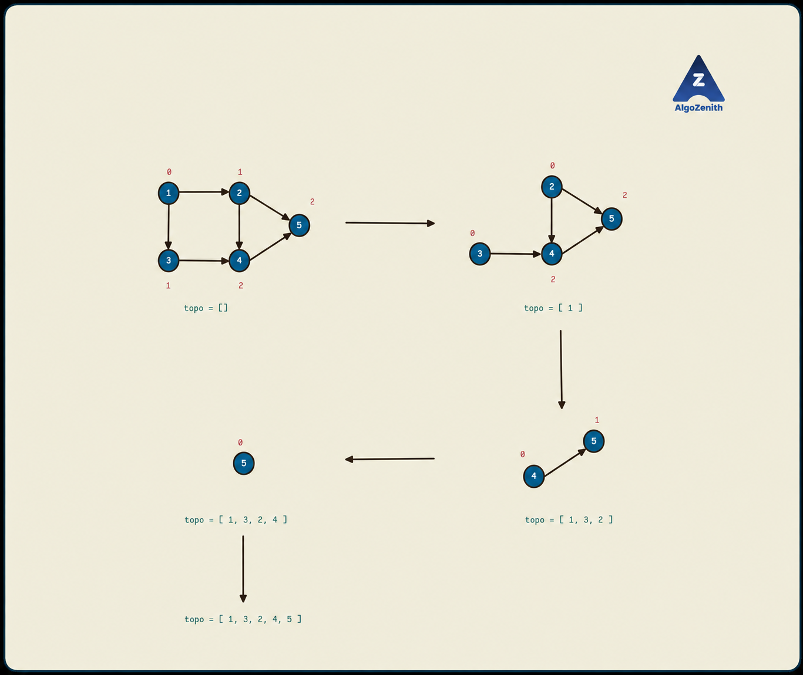

<VIDEO_WIDGET>

<VIDEO_ID></VIDEO_ID>

</VIDEO_WIDGET>

<READING_WIDGET>

# Topological Ordering Using BFS: Kahn's Algorithm

In the previous lesson, DFS produced a topological order by reversing the order in which vertices finished. **Kahn's algorithm builds the answer from left to right:** repeatedly choose a vertex whose remaining prerequisites have all been processed.

For every directed edge `u -> v`, a topological order must place `u` before `v`. Such an ordering exists exactly when the directed graph is acyclic: a **Directed Acyclic Graph (DAG)**.

## 1. The Key Idea: Remaining In-Degree

The **in-degree** of a vertex is the number of edges entering it.

If `u -> v` means that `u` must be completed before `v`, then a vertex with in-degree 0 has no prerequisites and can be placed next.

After processing `u`, conceptually remove it and its outgoing edges. For every edge `u -> v`, decrease `indeg[v]` by 1. When this value becomes 0, all prerequisites of `v` have been processed, so `v` becomes eligible.

**During the algorithm, `indeg[v]` counts incoming edges from vertices that have not yet been processed**, not the original in-degree.

We do not need to erase vertices or edges from the adjacency list. Updating these counters simulates their removal.

## 2. Queue-Based Algorithm

1. Calculate the in-degree of every vertex. For each input edge `u -> v`, increment `indeg[v]`.
2. Put **all** vertices with in-degree 0 into a queue, including isolated vertices.
3. While the queue is not empty:
   - Remove its front vertex `u` and append it to `topo`.
   - For every outgoing neighbour `v`, decrement `indeg[v]`.
   - If `indeg[v]` becomes exactly 0, enqueue `v`.
4. If `topo` contains all `n` vertices, it is a valid topological ordering. Otherwise, the graph contains a directed cycle.

Unlike DFS, **do not reverse** the resulting list. Vertices are appended when they are ready to appear in the answer.

Although this is commonly called the BFS approach to topological sorting, its queue means “ready to process,” not “next shortest-path layer from a source.” No source vertex or distance array is required.

## 3. Diagram and Dry Run



The red numbers show **remaining in-degrees**, and each `topo` list contains vertices already processed.

The graph has six directed edges:

```text
1 -> 3
1 -> 2
2 -> 4
2 -> 5
3 -> 4
4 -> 5
```

Initially:

| Vertex | Incoming edges from | In-degree |
| --- | --- | --- |
| 1 | None | 0 |
| 2 | 1 | 1 |
| 3 | 1 | 1 |
| 4 | 2, 3 | 2 |
| 5 | 2, 4 | 2 |

Only 1 is initially ready. To match the diagram, process the outgoing neighbours of 1 in the order **3, then 2**, as in the sample input below. Queue contents are shown **front to back**.

| Vertex removed | In-degree changes | Queue after processing | `topo` |
| --- | --- | --- | --- |
| — | Initial state | `[1]` | `[]` |
| 1 | `indeg[3]: 1 -> 0`, `indeg[2]: 1 -> 0` | `[3, 2]` | `[1]` |
| 3 | `indeg[4]: 2 -> 1` | `[2]` | `[1, 3]` |
| 2 | `indeg[4]: 1 -> 0`, `indeg[5]: 2 -> 1` | `[4]` | `[1, 3, 2]` |
| 4 | `indeg[5]: 1 -> 0` | `[5]` | `[1, 3, 2, 4]` |
| 5 | No outgoing edges | `[]` | `[1, 3, 2, 4, 5]` |

The diagram combines the processing of 3 and 2 into one transition. Vertex 4 becomes ready only after **both** have been processed; visiting one predecessor is not enough.

All five vertices are processed, and every directed edge goes from an earlier position to a later one. Thus, `1, 3, 2, 4, 5` is a valid topological order.

## 4. Why the Algorithm Is Correct

### Why Is a Zero-In-Degree Vertex Safe to Choose?

Its remaining in-degree is 0, so no unprocessed vertex must appear before it via an incoming edge. All its direct prerequisites are already in the answer.

Removing this vertex and its outgoing edges leaves the same problem on the remaining graph. Repeating this choice therefore respects every edge.

### Why Must a Nonempty DAG Have Such a Vertex?

Suppose every vertex had an incoming edge. Start at any vertex and repeatedly follow an incoming edge backwards. In a finite graph, some vertex must eventually repeat, creating a directed cycle.

Therefore, a nonempty acyclic graph must have at least one zero-in-degree vertex. The same holds for the graph remaining after any number of removals.

## 5. Detecting a Directed Cycle

Kahn's algorithm can be run on **any directed graph**. It either returns a full ordering or establishes that the input is not a DAG.

If the queue becomes empty before all vertices are processed, every remaining vertex has at least one incoming edge from another remaining vertex. By the reasoning above, that remaining graph contains a directed cycle.

The test is:

```cpp
if (static_cast<int>(topo.size()) != n) {
    cout << "Cycle Found\n";
}
```

Do not print the partial list as a topological ordering of the whole graph.

### Example: Some Vertices Can Be Processed Before We Get Stuck

```text
1 -> 2
2 -> 3
3 -> 2
3 -> 4
```

Only 1 is initially ready. After processing it, vertex 2 still has an incoming edge from 3. The queue is empty with only one of four vertices processed, so a cycle exists.

The cycle is `2 -> 3 -> 2`. Vertex 4 also remains unprocessed, but it is **not itself on a cycle**: it is blocked by a dependency on that cycle. Kahn's size check detects the existence of a cycle; the leftover vertices are not necessarily exactly the cycle vertices.

## 6. Lexicographically Smallest Topological Ordering

All topological orderings contain the same `n` vertices, so “lexicographically smallest” refers to their values, not their lengths.

Compare two sequences at the first position where they differ. The one with the smaller vertex label at that position is lexicographically smaller.

For the illustrated graph:

```text
FIFO queue order:                 1, 3, 2, 4, 5
Lexicographically smallest order: 1, 2, 3, 4, 5
```

Both are valid, but the second chooses 2 rather than 3 at their first differing position.

### Replace the Queue with a Min-Heap

At each step, choose the **smallest currently available zero-in-degree vertex**. All other steps remain unchanged.

```cpp
priority_queue<int, vector<int>, greater<int>> ready;
```

Use `ready.top()` to read the smallest vertex, then `ready.pop()` to remove it. A C++ `priority_queue` has **no `front()` method**.

For the example, after processing 1 the available labels are `{2, 3}`. The heap selects 2, even though the input listed `1 -> 3` before `1 -> 2`. Processing 2 does not yet unlock 4, so 3 comes next, followed by 4 and 5.

### Why This Greedy Choice Works

At any position, the next vertex of a valid ordering must have no incoming edges from the remaining graph. Otherwise, an unprocessed predecessor would need to come before it.

Every zero-in-degree choice is safe in a DAG. Choosing the smallest one minimizes the current position without preventing completion. Repeating this argument gives the lexicographically smallest full ordering.

### Sorting Only the Initial Queue Is Not Enough

Consider vertices 1, 2, 3 with the single edge `1 -> 2`.

```text
Initial queue: [1, 3]
Process 1:    [3, 2]   // Newly ready 2 joins the back.
FIFO answer:  1, 3, 2
Min-heap:     1, 2, 3
```

Even an initially sorted queue, with sorted adjacency lists, does not continually select the smallest available vertex. The min-heap makes that choice after **every** update.

Do not sort the completed answer either: globally sorting vertex labels can violate dependencies.

## 7. Complete C++17 Implementation

The program below prints both variants for comparison. In a problem asking for just one order, call only the appropriate function and follow the required output format.

Both functions take the in-degree vector **by value**, giving each run a fresh copy. This matters because processing changes the counters. The graph is passed by const reference and is not modified.

### Input

- First line: `n m`, the numbers of vertices and directed edges.
- Next `m` lines: `u v`, representing the directed edge `u -> v`.
- Assume `n >= 1` and vertex labels from 1 to `n`.

### Output for This Lesson

- Print `Cycle Found` if no topological ordering exists.
- Otherwise, print the FIFO order and the lexicographically smallest order.

```cpp
#include <functional>
#include <iostream>
#include <queue>
#include <vector>
using namespace std;

vector<int> kahn(const vector<vector<int>>& g, vector<int> indeg) {
    int n = static_cast<int>(g.size()) - 1;
    queue<int> ready;
    vector<int> topo;

    for (int u = 1; u <= n; ++u) {
        if (indeg[u] == 0) ready.push(u);
    }

    while (!ready.empty()) {
        int u = ready.front();
        ready.pop();
        topo.push_back(u);

        for (int v : g[u]) {
            --indeg[v];
            if (indeg[v] == 0) ready.push(v);
        }
    }

    return topo;
}

vector<int> kahnLexicographic(const vector<vector<int>>& g,
                              vector<int> indeg) {
    int n = static_cast<int>(g.size()) - 1;
    priority_queue<int, vector<int>, greater<int>> ready;
    vector<int> topo;

    for (int u = 1; u <= n; ++u) {
        if (indeg[u] == 0) ready.push(u);
    }

    while (!ready.empty()) {
        int u = ready.top();
        ready.pop();
        topo.push_back(u);

        for (int v : g[u]) {
            --indeg[v];
            if (indeg[v] == 0) ready.push(v);
        }
    }

    return topo;
}

void printOrder(const vector<int>& order) {
    for (size_t i = 0; i < order.size(); ++i) {
        if (i > 0) cout << ' ';
        cout << order[i];
    }
    cout << '\n';
}

void solve() {
    int n, m;
    cin >> n >> m;
    vector<vector<int>> g(n + 1);
    vector<int> indeg(n + 1, 0);

    for (int i = 0; i < m; ++i) {
        int u, v;
        cin >> u >> v;
        g[u].push_back(v); // Directed edge: do not add v -> u.
        ++indeg[v];
    }

    vector<int> topo = kahn(g, indeg);
    if (static_cast<int>(topo.size()) != n) {
        cout << "Cycle Found\n";
        return;
    }

    // indeg still contains the original counts: kahn used a copy.
    vector<int> smallest = kahnLexicographic(g, indeg);

    cout << "FIFO topological order:\n";
    printOrder(topo);
    cout << "Lexicographically smallest topological order:\n";
    printOrder(smallest);
}

int main() {
    ios::sync_with_stdio(false);
    cin.tie(nullptr);
    solve();
    return 0;
}
```

If using `kahnLexicographic` alone, also check its returned size against `n`. A min-heap changes which ready vertex is selected, not the cycle-detection rule.

### Alternative: Negated Labels in a Max-Heap

C++'s default `priority_queue<int>` is a max-heap. With positive vertex labels, storing `-u` makes the smallest label have the largest stored value. If using this alternative, negate **every insertion** and negate the value returned by `top()`:

```cpp
priority_queue<int> ready;
ready.push(-u);          // Whenever vertex u becomes ready.
int next = -ready.top(); // Recover the smallest available label.
ready.pop();
```

This is equivalent, but the explicit min-heap used in the complete code avoids juggling signs.

## 8. Sample Runs

### Sample 1: The Illustrated DAG

Input:

```text
5 6
1 3
1 2
2 4
2 5
3 4
4 5
```

Output:

```text
FIFO topological order:
1 3 2 4 5
Lexicographically smallest topological order:
1 2 3 4 5
```

The FIFO order depends on insertion order. The min-heap order is the smallest valid sequence regardless of the order in which the edges were read.

### Sample 2: Cyclic Dependencies

Input:

```text
4 4
1 2
2 3
3 2
3 4
```

Output:

```text
Cycle Found
```

Only vertex 1 is processed. The partial order is not printed.

### Sample 3: A Newly Ready Smaller Vertex

Input:

```text
3 1
1 2
```

Output:

```text
FIFO topological order:
1 3 2
Lexicographically smallest topological order:
1 2 3
```

Vertex 3 is isolated, so it is ready from the start. Vertex 2 becomes ready only after processing 1.

## 9. Complexity

Let `n` be the number of vertices and `m` the number of directed edges.

| Variant | Time | Auxiliary space, excluding graph storage |
| --- | --- | --- |
| FIFO queue | `O(n + m)` | `O(n)` |
| Min-heap | `O(m + n log n)` | `O(n)` |

Each vertex is inserted and removed at most once. Each outgoing edge of a processed vertex causes one decrement. A heap operation costs `O(log n)`, but decrementing an in-degree is still constant time; not every edge causes a heap insertion.

Including adjacency lists, total space is `O(n + m)`. Running both variants as in the demonstration has total time `O(m + n log n)` for `n >= 2` (the single-vertex case is constant apart from reading its edges).

## 10. Common Mistakes and Useful Checks

- **Decrementing the wrong endpoint:** for `u -> v`, increment and later decrement `indeg[v]`, not `indeg[u]`.
- **Adding both directions:** this is a directed graph; adding `v -> u` changes the problem and creates a two-vertex cycle when `u != v`.
- **Starting from just one zero-in-degree vertex:** initialize with all of them, including isolated vertices and vertices in disconnected parts.
- **Enqueuing too early:** a vertex is ready only when its remaining in-degree becomes 0, not when its first predecessor is processed.
- **Using a visited array instead of in-degree:** being encountered does not mean all prerequisites are satisfied. No separate visited array is needed here.
- **Reusing modified counters:** recompute in-degrees or pass a copy before another run.
- **Forgetting the final size check:** an empty queue can mean successful completion or being stuck on cyclic dependencies.
- **Using `front()` on a priority queue:** use `top()` instead; `front()` is for the FIFO queue.
- **Reversing Kahn's answer:** unlike DFS completion order, Kahn's list is already in topological order.

A self-loop correctly prevents its vertex from becoming ready. If repeated directed edges occur in the input, the implementation counts and removes each occurrence consistently; do not deduplicate only the adjacency list or only the in-degree counts.

For verification, ensure that the output contains every vertex exactly once and that `pos[u] < pos[v]` holds for every directed edge `u -> v`.

## Quick Recap

- A zero-in-degree vertex has no remaining prerequisites.
- Process it and decrement the in-degrees of its outgoing neighbours.
- A FIFO queue produces one valid ordering; a min-heap produces the lexicographically smallest one.
- Processing fewer than `n` vertices proves that a directed cycle exists.
- Preserve or rebuild the original in-degrees before rerunning the algorithm.

</READING_WIDGET>
